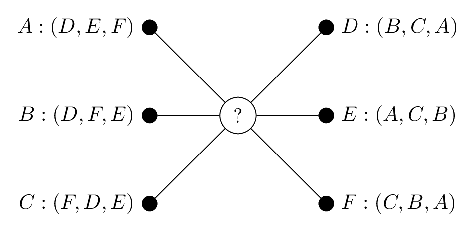

[](https://github.com/ambv/black)
[](https://doi.org/10.5281/zenodo.2553125)
[](https://doi.org/10.21105/joss.02169)


# A package for solving matching games

Matching games allow for the allocation of resources and partnerships in
a fair way. Typically, a matching game is defined by two sets of players
that each have preferences over at least some of the elements of the
other set. The objective of the game is then to find a mapping between
the sets of players in which everyone is happy enough with their match.

In `matching`, we deal with four types of matching game:

-   the stable marriage problem (SM);
-   the hospital-resident assignment problem (HR);
-   the student-allocation problem (SA);
-   the stable roommates problem (SR).

## Installation

Matching requires Python 3.5 or above, and relies only on
[NumPy](http://www.numpy.org/) for general use.

The library is most easily installed using `pip`:

```bash
    $ python -m pip install matching
```

However, if you would like to install it from source then go ahead and
clone the GitHub repository:

```bash
    $ git clone https://github.com/daffidwilde/matching.git
    $ cd matching
    $ python -m pip install .
```

## Documentation

Full documentation (including tutorials and discussion material) is
available here: <https://daffidwilde.github.io/matching/>

An academic paper on this library has been included in the Journal of
Open Source Software (JOSS) and is available here:
<https://joss.theoj.org/papers/10.21105/joss.02169>

## Playing a simple game

With all games, Matching uses a `Player` class to represent the members
of the "applying" party, i.e. residents and students. For HR and SA,
there are specific classes to represent the roles of `Hospital`,
`Project` and `Supervisor`.

Consider the following instance of SM which is represented on a
bipartite graph where the suitors and reviewers are along the left and
right respectively.

{.align-center width="10cm"}

We can construct these preferences using dictionaries:

```python
>>> suitor_preferences = {
...     "A": ["D", "E", "F"], "B": ["D", "F", "E"], "C": ["F", "D", "E"]
... }
>>> reviewer_preferences = {
...     "D": ["B", "C", "A"], "E": ["A", "C", "B"], "F": ["C", "B", "A"]
... }

```

Then to solve this matching game, we make use of the `StableMarriage`
class, like so:


```python
>>> from matching.games import StableMarriage
>>> game = StableMarriage.create_from_dictionaries(
...     suitor_preferences, reviewer_preferences
... )
>>> game.solve()
{A: E, B: D, C: F}

```

## The `Matching` object

This matching is not a standard Python dictionary, though it does
largely look and behave like one. It is in fact an instance of the
`SingleMatching` class:

```python
>>> matching = game.matching
>>> type(matching)
<class 'matching.matchings.SingleMatching'>

```

This dictionary-like object is primarily useful as a teaching device
that eases the process of manipulating a matching after a solution has
been found.

## `Player` classes

Despite passing dictionaries of strings here, the matching displays
instances of `matching.player.Player`:

```python
>>> matching = game.matching
>>> for suitor in matching:
...     print(type(suitor))
<class 'matching.players.player.Player'>
<class 'matching.players.player.Player'>
<class 'matching.players.player.Player'>

```

This is because `create_from_dictionaries` creates instances of the
appropriate player classes first and passes them to the game class.
Using dictionaries like this can be an efficient way of creating large
games but it does require the names of the players in each party to be
unique.

With all games, Matching uses a `Player` class to represent the members
of the "applying" party, i.e. residents and students. For HR and SA,
there are specific classes to represent the roles of `Hospital`,
`Project` and `Supervisor`.

## A note on performance

One of the limitations of this library is the time complexities of the
algorithm implementations. In practical terms, the running time of any
of the algorithms in Matching is negligible but the theoretic complexity
of each has not yet been attained. For example, an instance of HR with
400 applicants and 20 hospitals is solved in less than one tenth of a
second:

```python
>>> from matching.games import HospitalResident
>>> import numpy as np
>>> prng = np.random.default_rng(0)
>>> num_residents, num_hospitals = 400, 20
>>> resident_prefs = {
...     r: np.argsort(prng.random(size=num_hospitals))
...     for r in range(num_residents)
... }
>>> hospital_prefs = {
...     h: np.argsort(prng.random(size=num_residents))
...     for h in range(num_hospitals)
... }
>>> capacities = {h: num_hospitals for h in hospital_prefs}
>>> game = HospitalResident.create_from_dictionaries(
...     resident_prefs, hospital_prefs, capacities
... )
>>> _ = game.solve() # 48.6 ms ± 963 µs per loop

```

## Get in contact!

I hope this package is useful, and feel free to contact me here with any
issues or recommendations. Pull requests are always welcome!
