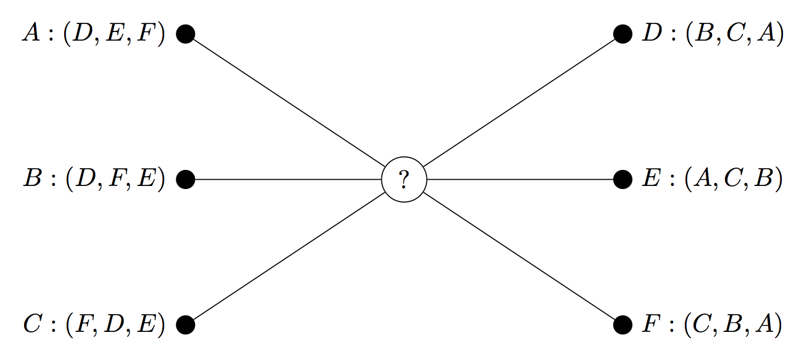
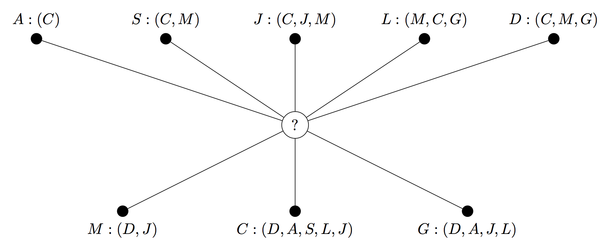

Matching
========

.. image:: https://img.shields.io/pypi/v/matching.svg
   :target: https://pypi.org/project/matching/

A package for solving matching games.
-------------------------------------

A matching game is defined by two sets, called suitors and reviewers. Each
suitor has a ranked preference list of the reviewers and vice versa. The
objective of a matching game is to find a mapping between the two sets such that
no pair in the mapping can do better without destablising the other matchings.

In ``matching``, we divide matching games into two general problems; these are
known colloquially as stable marriage problems and hospital-resident assignment
problems, respectively.

The stable marriage problem
---------------------------

Here, our sets must be of the same size and we require each suitor (and
reviewer) to rank all members of the other set. In this way, we obtain a
matching between our suitors and reviewers where each suitor is matched to
exactly one reviewer, and so our matching is bijective.

It is known that instances of the stable marriage problem can be solved to give
a unique, stable and suitor-optimal matching using an algorithm developed by
David Gale and Lloyd Shapley. The algorithm is as follows:

0. Assign all suitors and reviewers to be unmatched.

1. Take any unmatched suitor, **s**, and their most preferred reviewer, **r**.
   If all suitors are matched, end.
    
2. If **r** is unmatched, then match **s** to **r**, and go to 1. Otherwise, go
   to 3.
    
3. Consider **r**'s current match, **s'**. If **r** prefers **s** to **s'**,
   then unmatch **s'** from **r** and match **s** to **r**. Otherwise, leave
   **s** unmatched and remove **r** from the preference list of **s**. In either
   case, go to 1.

By unique, we mean that the result of this algorithm is invariant of which order
unmatched suitors are considered. Stability is the concept that the pairings in
the matching are such that nobody could be matched to someone they prefer more
without their new partner then being able to be with someone better.
The final matching being suitor-optimal means that every suitor has their best
possible matching without making the matching unstable. A corollary of this is
that, in fact, every reviewer has their worst possible matching after the
algorithm terminates.

Usage
^^^^^

With both forms of matching game, ``matching`` uses standard dictionaries to
construct and solve a given instance. In particular, for instances of the stable
marriage problem, we require a dictionary detailing the preference lists of each
suitor (and reviewer).

Consider the following stable marriage problem which is represented on a
bipartite graph.

We convey the information above in the following way:

>>> suitor_prefs = {'A': ['D', 'E', 'F'],
...                 'B': ['D', 'F', 'E'],
...                 'C': ['F', 'D', 'E']}
>>> reviewer_prefs = {'D': ['B', 'C', 'A'],
...                   'E': ['A', 'C', 'B'],
...                   'F': ['C', 'B', 'A']}

Then to solve this matching game, we make use of the ``algorithms`` submodule,
like so:

>>> from matching.algorithms import galeshapley
>>> matching = galeshapley(suitor_prefs, reviewer_prefs)
>>> matching
{'A': 'E', 'B': 'D', 'C': 'F'}

It is easily checked - on paper or mentally - that this is the correct solution.

The hospital-resident assignment problem
----------------------------------------

For this family of problems, we have a set of suitors (residents) and reviewers
(hospitals), and ranked preferences associated with each element of these sets,
as in the stable marriage problem. However, we do not require these sets to be
of the same size, nor do we require any given suitor (or reviewer) to rank all
elements of the other set. In addition to these sets, each reviewer has
associated with it a capacity. This capacity is the maximum number of suitors
that may be matched to it at any given time.

The algorithm which solves this problem is famously utilised in the USA by the
`National Resident Matching Program <http://www.nrmp.org/>`_, hence the
nickname. In fact, research surrounding this algorithm won Shapley, along with
Alvin Roth, the `Nobel Prize for Economics <http://www.nytimes.com/2012/10/16/
business/economy/
alvin-roth-and-lloyd-shapley-win-nobel-in-economic-science.html>`_ in 2012. In
this package we refer to this algorithm as the Extended Gale-Shapley algorithm.
However, it has several synonyms including: 'The Match', 'the Capacitated
Gale-Shapley algorithm', 'the Roth-Shapley algorithm', and 'the deferred
acceptance algorithm'. This algorithm has also been used to develop donor chains
for kidney transplants saving thousands of lives in the process.

The algorithm is as follows:

0. Assign all suitors and reviewers to be unmatched.

1. Take any unmatched suitor, **s**, that is still up for consideration, and go
   to 2. If there are no such suitors, end. 

2. If the preference list of **s** is empty, remove them from consideration, and
   go to 1. Otherwise, consider their most preferred reviewer, **r**. Go to 3.

3. If **s** is not ranked by **r**, remove **r** from the preference list of
   **s** and go to 2. Otherwise, if **r** has space, match **s** to **r** and go
   to 1. If not, go to 4.

4. Consider **r**'s current matching, and particular their least preferable
   current matching, **s'**. If **r** prefers **s** to **s'**, then unmatch
   **s'** from **r**, match **s** to **r**, and go to 1. Otherwise, leave **s**
   unmatched, remove **s** from the preference list of **r** and **r** from the
   preference list of **s**, and go to 2.

Usage
^^^^^

In a similar fashion to the stable marriage problem, we interpret
hospital-resident assignment problems using dictionaries. In addition to the
suitor and reviewer preference dictionaries, however, we have a capacity
dictionary which takes reviewers as keys and integer capacities as values.

Consider the following `example <http://www.nrmp.org/matching-algorithm/>`_. We have five medical residents - Arthur, Sunny,
Joseph, Latha and Darrius - and three hospitals, each with 2 positions
available: Mercy, City and General. We display their preferences in a similar
fashion to before:

In ``matching`` we summarise this problem in the following way:

>>> suitor_prefs = {'A': ['C'],
...                 'S': ['C', 'M'],
...                 'J': ['C', 'G', 'M'],
...                 'L': ['M', 'C', 'G'],
...                 'D': ['C', 'M', 'G']}
>>> reviewer_prefs = {'M': ['D', 'J'],
...                   'C': ['D', 'A', 'S', 'L', 'J'],
...                   'G': ['D', 'A', 'J', 'L']}
>>> capacities = {r: 2 for r in reviewer_prefs.keys()}

We then solve this problem using the ``extended_galeshapley`` algorithm:

>>> from matching.algorithms import extended_galeshapley
>>> suitor_match, reviewer_match = extended_galeshapley(suitor_prefs,
...                                                     reviewer_prefs,
...                                                     capacities)
>>> suitor_match
{'A': 'C', 'S': None, 'J': 'G', 'L': 'G', 'D': 'C'}

Again, though less likely to be done in your head, you can verify that this
matching is correct according to our algorithm.

Get in contact!
---------------

I hope this package is useful, and please feel free to ping me here (or on Twitter: `@daffidwilde <https://twitter.com/daffidwilde>`_) with any issues or recommendations. PRs always welcome!
