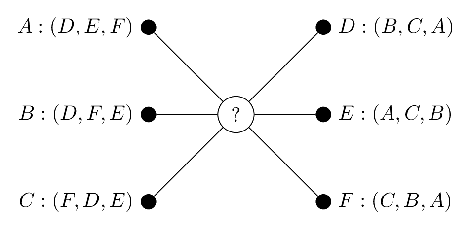
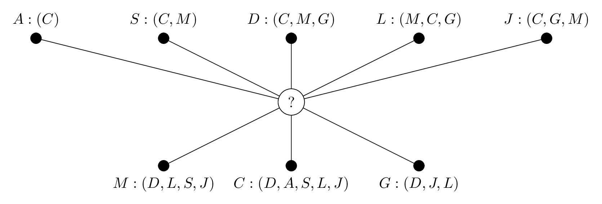

Matching
========

.. image:: https://img.shields.io/pypi/v/matching.svg
    :target: https://pypi.org/project/matching/

.. image:: https://github.com/daffidwilde/matching/workflows/CI/CD/badge.svg
    :target: https://github.com/daffidwilde/matching/actions?query=workflow%3ACI%2FCD+branch%3Amaster

.. image:: https://img.shields.io/badge/code%20style-black-000000.svg
    :target: https://github.com/ambv/black

.. image:: https://zenodo.org/badge/119597240.svg
    :target: https://zenodo.org/badge/latestdoi/119597240

.. image:: https://joss.theoj.org/papers/10.21105/joss.02169/status.svg
    :target: https://doi.org/10.21105/joss.02169

A package for solving matching games.
-------------------------------------

A matching game is defined by two sets of players. Each player in one set has a
ranked preference list of those in the other, and the objective is to find some
mapping between the two sets such that no pair of players are unhappy. The
context of the terms "mapping" and "unhappy" are dependent on the framework of
the particular game being played but are largely to do with the stability of the
pairings.

In ``matching``, we deal with four types of matching game:

- the stable marriage problem (SM);
- the hospital-resident assignment problem (HR);
- the student-allocation problem (SA);
- the stable roommates problem (SR).

Installation
------------

Matching is written in Python 3, and relies only on `NumPy
<http://www.numpy.org/>`_ for general use.

The library is most easily installed using :code:`pip`::

    $ python -m pip install matching

However, if you would like to install it from source then go ahead and clone the
GitHub repo::

    $ git clone https://github.com/daffidwilde/matching.git
    $ cd matching
    $ python setup.py install

Using the ``Player`` class
--------------------------

With all of these games, ``matching`` uses a ``Player`` class to represent the
members of the "applying" party, i.e. residents and students. For HR and SA,
there are specific classes to represent the roles of ``Hospital``, ``Project``
and ``Supervisor``.

For instances of SM, we require two lists of ``Player`` instances -- one for
each party detailing their preferences.

Consider the following problem which is represented on a bipartite graph.

We construct the players in this game in the following way:

>>> from matching import Player

>>> suitors = [Player(name="A"), Player(name="B"), Player(name="C")]
>>> reviewers = [Player(name="D"), Player(name="E"), Player(name="F")]
>>> (A, B, C), (D, E, F) = suitors, reviewers

>>> A.set_prefs([D, E, F])
>>> B.set_prefs([D, F, E])
>>> C.set_prefs([F, D, E])

>>> D.set_prefs([B, C, A])
>>> E.set_prefs([A, C, B])
>>> F.set_prefs([C, B, A])

Then to solve this matching game, we make use of the ``StableMarriage`` class,
like so:

>>> from matching.games import StableMarriage
>>> game = StableMarriage(suitors, reviewers)
>>> game.solve()
{A: E, B: D, C: F}

Note
++++

This matching is not a standard Python dictionary, though it does largely look
and behave like one. It is in fact an instance of the ``Matching`` class:

>>> matching = game.matching
>>> type(matching)
<class 'matching.matching.Matching'>

This dictionary-like object is primarily useful as a teaching device that eases
the process of manipulating a matching after a solution has been found. 

Using dictionaries
------------------

For larger game instances, creating players directly (as above) could be
unreasonably tedious. An alternative approach is to create an instance of a game
from Python dictionaries. For example, consider the following instance of HR:

There are five residents -- Ada, Sam, Jo, Luc, Dani -- applying to work at three
hospitals: Mercy, City, General. Each hospital has two available positions, and
the players' preferences of one another are as follows:

This information can be conveyed as a few dictionaries like so:

>>> resident_prefs = {
...     "A": ["C"],
...     "S": ["C", "M"],
...     "D": ["C", "M", "G"],
...     "J": ["C", "G", "M"],
...     "L": ["M", "C", "G"],
... }
>>> hospital_prefs = {
...     "M": ["D", "L", "S", "J"],
...     "C": ["D", "A", "S", "L", "J"],
...     "G": ["D", "J", "L"],
... }
>>> capacities = {hosp: 2 for hosp in hospital_prefs}

Then, similarly, this game is solved using the ``HospitalResident`` class but an
instance is created using the ``create_from_dictionaries`` class method:

>>> from matching.games import HospitalResident
>>> game = HospitalResident.create_from_dictionaries(
...     resident_prefs, hospital_prefs, capacities
... )
>>> game.solve()
{M: [L, S], C: [D, A], G: [J]}

Note
++++

Despite passing dictionaries of strings here, the matching displays instances of
``matching`` players:

>>> matching = game.matching
>>> for hospital in matching:
...     print(type(hospital))
<class 'matching.players.hospital.Hospital'>
<class 'matching.players.hospital.Hospital'>
<class 'matching.players.hospital.Hospital'>

This is because ``create_from_dictionaries`` creates instances of the
appropriate player classes first and passes them to the game class. Using
dictionaries like this can be an efficient way of creating large games but it
does require the names of the players in each party to be unique.

Documentation
-------------

Full documentation is available here: `<https://matching.readthedocs.io>`_

A note on performance
---------------------

One of the limitations of this library is the time complexities of the algorithm
implementations. In practical terms, the running time of any of the algorithms
in Matching is negligible but the theoretic complexity of each has not yet been
attained. For example, an instance of HR with 400 applicants and 20 hospitals is
solved in less than one tenth of a second:

>>> from matching.games import HospitalResident
>>> import numpy as np
>>> np.random.seed(0)
>>> resident_prefs = {
...     r: np.argsort(np.random.random(size=20)) for r in range(400)
... }
>>> hospital_prefs = {
...     h: np.argsort(np.random.random(size=400)) for h in range(20)
... }
>>> capacities = {h: 20 for h in hospital_prefs}
>>> game = HospitalResident.create_from_dictionaries(
...     resident_prefs, hospital_prefs, capacities
... )
>>> _ = game.solve() # 48.6 ms ± 963 µs per loop

Get in contact!
---------------

I hope this package is useful, and feel free to contact me here (or on Twitter:
`@daffidwilde <https://twitter.com/daffidwilde>`_) with any issues or
recommendations. Pull requests are always welcome!
